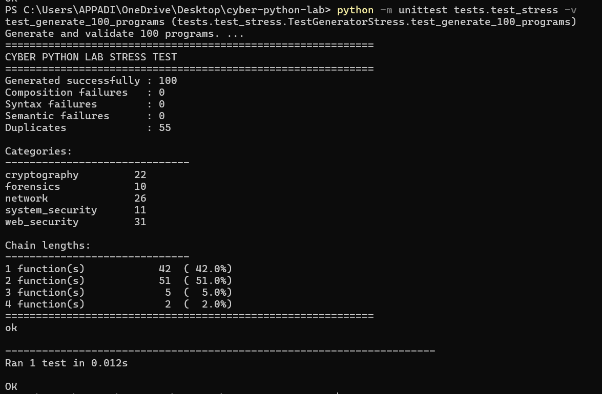

# Project Overview

## 1. Introduction

Cyber Python Lab is a Python-based program generation system designed around cybersecurity-oriented components. The project automatically composes small security utilities from a structured component library rather than asking an external language model to write a complete program from scratch.

The central idea is to represent useful cybersecurity operations as typed building blocks. Each function declares the data it requires and the data it produces. A composition engine then searches for compatible components and assembles them into a complete Python program.

This approach makes the generation process explicit, testable, and maintainable.

## 2. Problem Statement

A conventional collection of cybersecurity scripts grows as a set of independent programs. This creates several limitations:

- Reuse between programs is limited.
- Program construction is largely manual.
- It is difficult to reason about whether two operations can be safely connected.
- Automated generation can easily produce syntactically valid but logically incompatible code.
- Documentation can become inconsistent as the number of scripts increases.

Cyber Python Lab addresses these issues by introducing a component-oriented generation model.

## 3. Project Objectives

The project was designed to achieve five primary objectives:

1. Build reusable cybersecurity programming components.
2. Compose those components according to declared data dependencies.
3. Validate generated source before accepting it.
4. Detect duplicate programs before publication.
5. Automate the generation and publication process through GitHub Actions.

## 4. Current Scope

The current component library covers five areas:

### Cryptography

Examples include:

- Text hashing
- Base64 encoding and decoding
- Hash description
- Entropy calculation

### Forensics

Examples include:

- File hashing
- File-size inspection
- File-size classification
- Entropy analysis

### Network Security

Examples include:

- Hostname resolution
- IP validation
- IP analysis
- Subnet calculation
- Domain extraction
- IP classification

### System Security

Examples include:

- File permission inspection
- Permission classification

### Web Security

Examples include:

- URL extraction
- URL counting
- Domain-oriented processing

The focus is on defensive analysis, inspection, validation, and educational utilities.

## 5. Generation Model

A generated program begins with an input component.

The composer identifies a function whose requirements can be satisfied by that input. After selecting the first function, the resulting data types become available to subsequent functions.

Conceptually:

```text
Input
  |
  v
Function A
  |
  v
Function B
  |
  v
Function C
  |
  v
Output
```

The chain is only extended when the next component's requirements are satisfied by data already available in the chain.

## 6. Artifact Structure

Each accepted program is stored independently:

```text
programs/
└── <category>/
    └── <program-name>/
        ├── <program-name>.py
        └── README.md
```

This makes each generated utility independently readable and reusable.

## 7. Why the Design Matters

The important engineering decision is that randomness is constrained.

The generator is random in selecting compatible components, but it is not random in the sense of producing arbitrary code. Component contracts define what can be connected.

This creates a useful balance:

```text
Random selection
      +
Explicit constraints
      =
Controlled program generation
```

## 8. Current Validation Evidence

The latest recorded stress test generated 100 programs successfully.

```text
Generated successfully : 100
Composition failures   : 0
Syntax failures        : 0
Semantic failures      : 0
Duplicates             : 55
```

The same run produced 58 multi-function programs:

```text
1 function(s) : 42
2 function(s) : 51
3 function(s) : 5
4 function(s) : 2
```

The component graph therefore supports both isolated utilities and multi-stage processing chains.



## 9. Intended Outcome

The long-term goal is a repository that can continue producing small, documented cybersecurity utilities without requiring manual creation of every script.

The generator becomes the system that creates the laboratory, while the generated programs become the growing body of practical examples.
